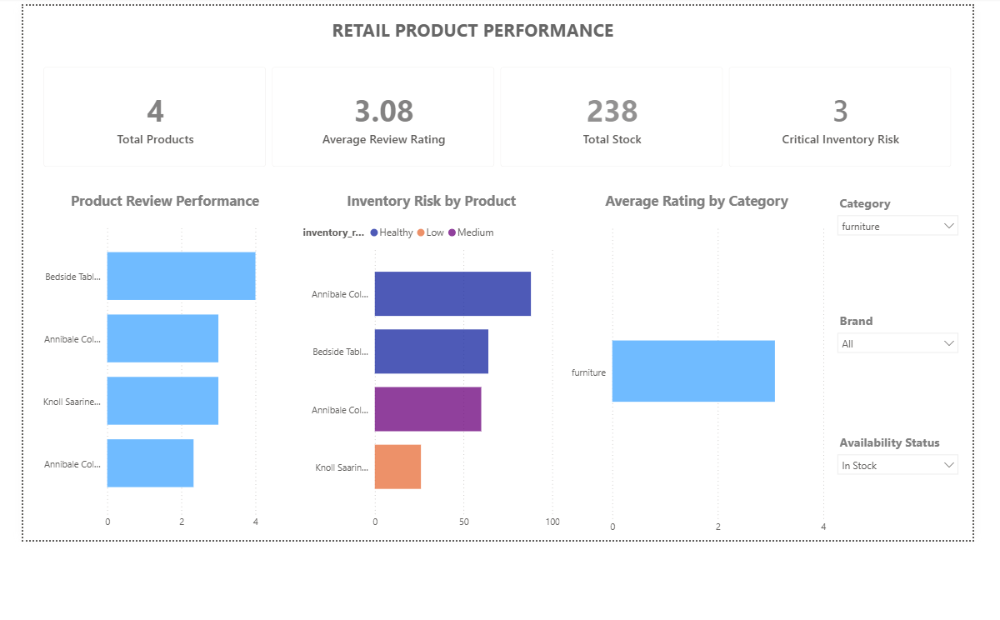

# Microsoft Fabric Retail Data Engineering Platform

End-to-end retail data engineering platform built with **Microsoft Fabric, PySpark, Delta Lake, OneLake, Fabric Data Factory and Power BI**.

The project demonstrates the ingestion, transformation, validation, orchestration and analytical consumption of semi-structured REST API data using a **Medallion Architecture**.

---

## Architecture

```text
DummyJSON REST API
        │
        ▼
Fabric Copy Job
        │
        ▼
Bronze Lakehouse
Raw JSON
        │
        │ PySpark
        ▼
Silver Lakehouse
Clean Delta Tables
        │
        │ PySpark
        ▼
Gold Lakehouse
Business Models / KPIs
        │
        ▼
Power BI
Retail Performance Dashboard
```

The complete workflow is orchestrated through a Microsoft Fabric Data Pipeline:

```text
Copy Job
   ↓
Bronze_to_Silver
   ↓
Silver_to_Gold
```

Success dependencies ensure that downstream processing executes only after the preceding activity completes successfully.

---

## Technology Stack

- Microsoft Fabric
- Fabric Data Factory
- OneLake
- Fabric Lakehouse
- Apache Spark / PySpark
- Delta Lake
- REST API
- Fabric Notebooks
- Fabric Data Pipelines
- Power BI
- Git / GitHub

---

## Data Source

Retail product data is retrieved from the **DummyJSON REST API**.

The source contains information including:

- Product identifiers
- Product names
- Categories
- Brands
- Prices
- Discounts
- Ratings
- Inventory levels
- Product dimensions
- Metadata
- Customer reviews

The API response contains nested structures and arrays, providing a realistic semi-structured ingestion and transformation scenario.

---

## Bronze Layer

The Bronze layer preserves the raw API response with minimal modification.

**Lakehouse**

`lh_retail_bronze`

**Landing path**

```text
Files/raw/products/products.json
```

Fabric Copy Job retrieves the REST API payload and stores the original JSON response in OneLake.

Preserving the original source representation provides traceability and allows downstream transformations to be reproduced from the raw data.

---

## Silver Layer

The Silver layer converts the nested JSON into structured and validated Delta tables.

**Lakehouse**

`lh_retail_silver`

**Implementation**

[`notebooks/nb_bronze_to_silver_products.ipynb`](notebooks/nb_bronze_to_silver_products.ipynb)

### Transformations

PySpark is used to:

- Read the raw JSON payload
- Validate the expected source schema
- Explode the `products` array
- Flatten nested product structures
- Flatten product dimensions and metadata
- Standardize column names
- Handle missing brand values
- Explode customer reviews
- Preserve `product_id` for product-review relationships
- Validate critical business and technical rules

### Silver Tables

#### `dbo.products`

**Grain:** One row per product.

Contains cleaned and flattened product information.

#### `dbo.product_reviews`

**Grain:** One row per customer review.

Each review retains its parent `product_id`, producing a one-to-many relationship between products and reviews.

---

## Data Quality

Critical data-quality checks are implemented before Silver data is persisted.

Checks include:

- Required source schema validation
- Non-empty product dataset validation
- Null product ID detection
- Duplicate product ID detection
- Negative price detection
- Negative inventory detection
- Rating range validation
- Critical-column completeness checks

Critical failures raise exceptions within the PySpark notebook.

This causes the Bronze-to-Silver pipeline activity to fail and prevents downstream Gold transformations from executing against invalid data.

```text
Source Data
     │
     ▼
Schema Validation
     │
     ▼
Business / Technical Quality Checks
     │
     ├──── Failure ────► Exception ────► Pipeline Failure
     │
     ▼
Validated Silver Data
     │
     ▼
Gold Processing
```

---

## Gold Layer

The Gold layer contains analytics-ready datasets designed around simulated retail business requirements.

**Lakehouse**

`lh_retail_gold`

**Implementation**

[`notebooks/nb_silver_to_gold_retail.ipynb`](notebooks/nb_silver_to_gold_retail.ipynb)

### `dbo.brand_category_performance`

Supports management analysis of brand performance within product categories.

Metrics include:

- Average price
- Total stock
- Average rating
- Average discount
- Dense ranking of brands within categories

PySpark window functions partition the dataset by category and rank brands according to average rating.

### `dbo.inventory_risk`

Supports inventory and replenishment monitoring.

Products are classified using business rules into:

- Critical
- Low
- Medium
- Healthy

### `dbo.customer_review_performance`

Supports customer-experience analysis.

Individual reviews are classified as **Good, Fair or Bad** and aggregated to product level.

Metrics include:

- Average review rating
- Total reviews
- Good reviews
- Fair reviews
- Bad reviews
- Overall review-performance classification

### `dbo.category_performance_kpi`

Provides commercial category-level KPIs including:

- Product count
- Average price
- Total stock
- Average rating
- Average discount

### `dbo.dim_product`

Provides a clean product dimension for BI filtering and analytical slicing.

Attributes include:

- Product surrogate key
- Source product ID
- SKU
- Product title
- Category
- Brand
- Availability status

A deterministic surrogate key is generated using `xxhash64`.

---

## Business Requirements

The Gold layer was designed around five simulated business requirements.

### Management

Identify the strongest-performing brands and categories based on price, inventory, ratings and discount levels.

### Operations

Identify products with low inventory and potential replenishment risk.

### Customer Experience

Determine which products receive strong, average or weak customer reviews.

### Commercial

Compare category-level price, stock, rating, discount and product-count KPIs.

### BI / Reporting

Provide clean product attributes for dashboard filtering and analytical slicing.

---

## Orchestration

Microsoft Fabric Data Pipeline orchestrates the complete workflow.

```text
REST API
   ↓
Copy Job
   ↓
Bronze Lakehouse
   ↓
Bronze_to_Silver Notebook
   ↓
Silver Lakehouse
   ↓
Silver_to_Gold Notebook
   ↓
Gold Lakehouse
   ↓
Power BI
```

Success dependencies ensure that downstream transformations execute only after upstream processing completes successfully.

A complete end-to-end pipeline execution was validated successfully.

### Pipeline Artifact

The exported Microsoft Fabric pipeline is available under:

[`pipeline/pl_retail_ingestion.zip`](pipeline/pl_retail_ingestion.zip)

Additional pipeline documentation is available here:

[`pipeline/README.md`](pipeline/README.md)

---

## Power BI

Power BI Desktop consumes the Fabric Gold layer through OneLake.

The **Retail Product Performance** dashboard provides interactive analysis of product performance, customer reviews and inventory risk.

### KPI Cards

- Total Products
- Average Review Rating
- Total Stock
- Critical Inventory Risk

### Analytical Visuals

- Product Review Performance
- Inventory Risk by Product
- Average Rating by Category

### Interactive Filters

- Category
- Brand
- Availability Status

The semantic model uses `dim_product` to support product-level filtering across the analytical datasets.

### Dashboard



### Power BI Artifacts

The repository contains both the Power BI report and reusable template:

```text
powerbi/
├── Retail_Product_Performance.pbix
├── Retail_Product_Performance.pbit
└── README.md
```

See [`powerbi/README.md`](powerbi/README.md) for additional information.

---

## Idempotency

Silver and Gold datasets currently use **overwrite semantics**.

This makes repeated executions deterministic for the current full-snapshot API source and prevents duplicate accumulation between pipeline runs.

For larger production workloads, the architecture could be extended with incremental processing using:

- Delta `MERGE`
- Source watermarks
- Change timestamps
- Change Data Capture (CDC)
- Incremental Gold recalculation

---

## Repository Structure

```text
fabric-retail-data-platform/
│
├── README.md
├── .gitignore
│
├── notebooks/
│   ├── nb_bronze_to_silver_products.ipynb
│   └── nb_silver_to_gold_retail.ipynb
│
├── pipeline/
│   ├── README.md
│   └── pl_retail_ingestion.zip
│
├── powerbi/
│   ├── README.md
│   ├── Retail_Product_Performance.pbix
│   └── Retail_Product_Performance.pbit
│
├── docs/
│   └── ...
│
└── images/
    └── retail_dashboard.png
```

---

## Engineering Decisions

### Medallion Architecture

Bronze, Silver and Gold layers separate ingestion, transformation and analytical modelling responsibilities.

### Raw Data Preservation

The original REST API response is retained in Bronze to support traceability and reproducibility.

### PySpark for Transformation

PySpark performs schema handling, nested JSON flattening, validation, aggregation and analytical transformations.

### Delta Lake

Silver and Gold datasets are persisted as Delta tables, providing a transactional storage layer for the Lakehouse architecture.

### Fail-Fast Data Quality

Critical validation failures raise exceptions before Silver persistence, preventing invalid data from propagating into downstream analytical models.

### Explicit Data Grain

Silver and Gold tables are designed with clearly defined grains to avoid ambiguous analytical relationships.

### Deterministic Processing

Overwrite semantics provide deterministic and idempotent processing for the current full-snapshot source.

### Separation of Engineering and BI

Business transformations are performed upstream in the Gold layer, while Power BI primarily handles analytical presentation and interactive filtering.

---

## Future Improvements

Potential production enhancements include:

- Incremental ingestion and Delta `MERGE`
- Historical product tracking using SCD Type 2
- Pipeline scheduling
- Centralized logging and monitoring
- Data-quality audit tables
- Environment-specific DEV / TEST / PROD deployment
- CI/CD integration
- Fabric deployment pipelines
- Additional semantic-model measures
- Automated testing of transformation logic

---

## Project Outcome

The project demonstrates an end-to-end Microsoft Fabric data engineering workflow covering:

**REST API → Fabric Data Factory → OneLake → Medallion Architecture → PySpark → Delta Lake → Data Quality → Business Modelling → Pipeline Orchestration → Power BI**

It provides a compact implementation of a modern Lakehouse architecture while maintaining clear separation between:

- Raw ingestion
- Data validation
- Data transformation
- Business modelling
- Workflow orchestration
- Analytical consumption

The repository includes the **actual PySpark notebooks, exported Fabric pipeline, Power BI report and supporting technical documentation**, allowing the implementation to be inspected beyond architecture diagrams and screenshots.
